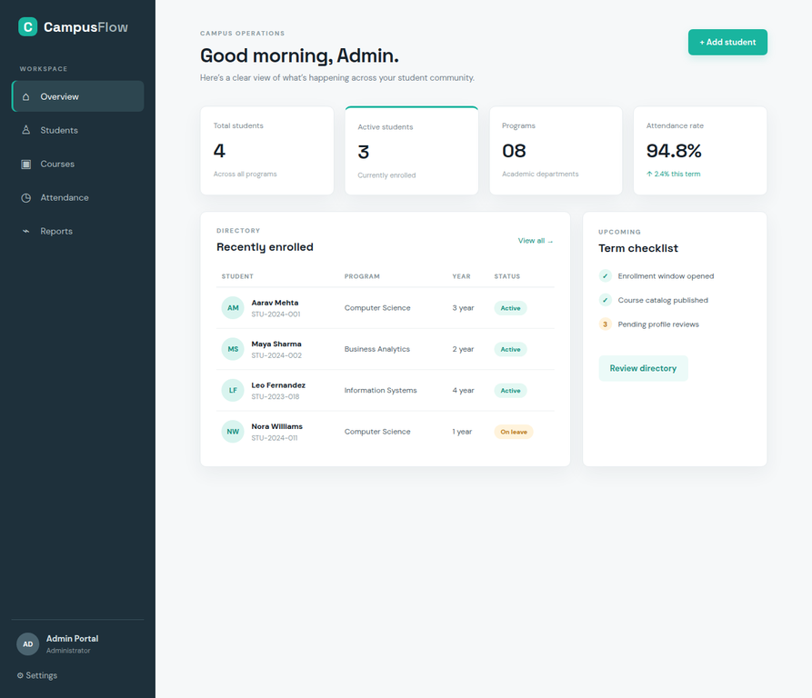
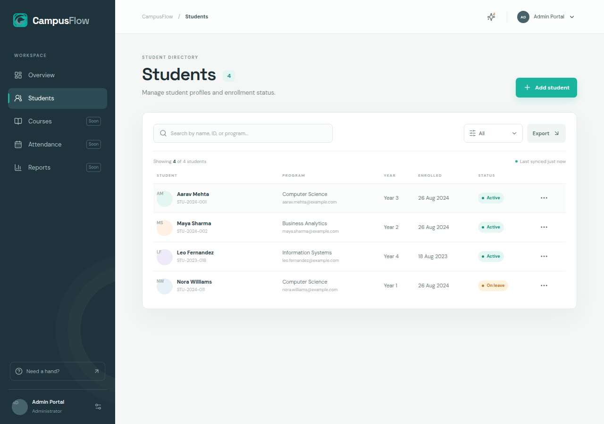
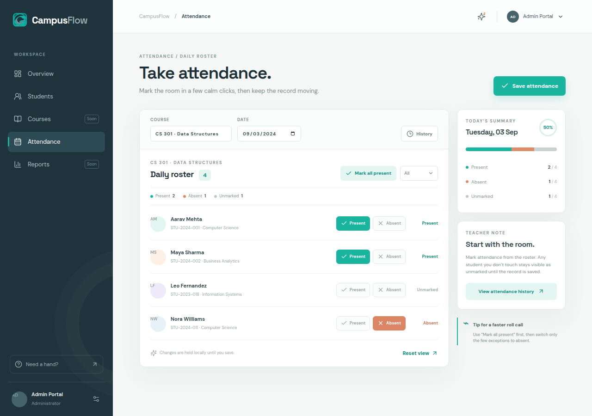

# CampusFlow Student Management System

CampusFlow is a polished student-operations workspace designed for teachers and academic administrators. It presents the day-to-day work of a student management system through a calm, structured interface: monitor enrollment health, browse student profiles, and take attendance without losing sight of the people behind the records.

> **Portfolio project:** This repository contains the responsive React frontend experience. It is designed to pair with a Java Spring Boot API and relational database for production persistence.

## Project overview

CampusFlow uses an editorial operations-desk approach instead of a generic admin template. The interface combines a persistent workspace sidebar, focused data surfaces, narrow context rails, and restrained Mineral Teal signals for actions and live status. The current build is frontend-only and uses local state so the main workflows can be demonstrated immediately.

## Features

| Area | Included experience |
| --- | --- |
| Overview dashboard | Enrollment metrics, campus pulse, enrollment momentum, recently enrolled students, and term checklist. |
| Student directory | Search by name, ID, or program; filter by status; add and edit student profiles; delete records from the current view. |
| Attendance | Select course and date, mark students Present or Absent, leave records Unmarked, filter the roster, mark all present, save attendance feedback, and review a daily summary. |
| Responsive workspace | Persistent desktop navigation, responsive mobile navigation drawer, stacked data surfaces, and touch-friendly controls. |
| Interaction feedback | Local optimistic UI updates, modal workflows, empty states, confirmation feedback, and placeholder toasts for future modules. |
| Visual system | CampusFlow brand mark, harbor navy rail, Mineral Teal action color, Space Grotesk display type, and DM Sans body type. |

## Technology stack

| Technology | Purpose |
| --- | --- |
| React 19 | Component-based frontend application. |
| TypeScript | Typed UI state, props, and interactions. |
| Vite | Fast development server and production bundling. |
| Tailwind CSS 4 | Utility foundation and design-token support. |
| Wouter | Lightweight client-side routing. |
| Lucide React | Consistent interface iconography. |
| Sonner | In-app toast feedback. |
| Spring Boot-ready architecture | Frontend workflows are structured for connection to Java REST or tRPC-compatible services. |

## Screens and live preview

The deployed project is available at [campusflow-gohifkaz.manus.space](https://campusflow-gohifkaz.manus.space).

### Dashboard



### Student directory



### Attendance workspace



| Screen | Preview |
| --- | --- |
| Overview dashboard | [Open dashboard](https://campusflow-gohifkaz.manus.space/) |
| Student directory | [Open student directory](https://campusflow-gohifkaz.manus.space/students) |
| Attendance workspace | [Open attendance page](https://campusflow-gohifkaz.manus.space/attendance) |

The dashboard, student directory, and attendance workspace are intentionally composed as the primary portfolio screens. Open the links above at desktop and mobile widths to review the responsive behavior.

## Getting started

### Prerequisites

Install Node.js 20 or later and pnpm. The project uses a Vite development server and does not require a database for the current frontend demonstration.

### Installation

```bash
git clone https://github.com/<your-account>/campusflow-student-management-system.git
cd campusflow-student-management-system
pnpm install
```

### Run locally

```bash
pnpm dev
```

Open `http://localhost:3000` in your browser. Use the sidebar to move between Overview, Students, and Attendance.

### Validate the project

```bash
pnpm check
pnpm build
```

`pnpm check` runs the TypeScript compiler without emitting files. `pnpm build` creates the production frontend bundle and verifies the project can be packaged successfully.

## Connecting a Java backend

For a full production version, connect the interface to a Java Spring Boot service with endpoints for students, courses, attendance records, and authentication. A typical next step is to replace the local state in `client/src/pages/Home.tsx` with typed API calls, then persist the domain model in MySQL or PostgreSQL through Spring Data JPA.

Recommended backend resources include `Student`, `Course`, `Enrollment`, `AttendanceRecord`, and `User` entities. Attendance writes should be idempotent for the tuple `(course, student, date)` so teachers can safely edit and save a roster more than once.

## Project structure

```text
client/
  src/
    pages/Home.tsx       # Dashboard, student directory, attendance workspace
    App.tsx              # Client-side routes
    index.css            # CampusFlow visual system and responsive styles
    components/ui/       # Reusable shadcn/ui primitives
server/
  index.ts               # Static production server wrapper
ideas.md                 # Design direction and accepted style decisions
todo.md                  # Project task checklist
```

## Design direction

CampusFlow follows the **Quiet Operations** direction: an editorial institutional workspace with deep harbor navy, mineral teal, mist-gray canvas surfaces, soft shadows, disciplined alignment, and compact uppercase micro-labels. The goal is to make operational work feel composed and legible rather than noisy.

## Future improvements

The most valuable next iterations are persistent Spring Boot API integration, role-based authentication for administrators and teachers, attendance history and exports, and automated email/browser/SMS notifications after provider credentials are configured.

## License

This project is provided as a portfolio and learning project. Add a license appropriate to your intended use before distributing it publicly.
